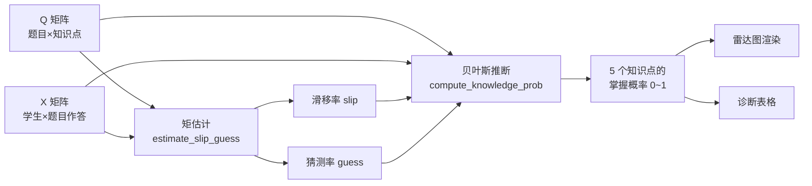

# 🧠 智能化认知诊断系统

基于 **DINA 模型**（Deterministic Inputs, Noisy "And" gate）的 AI+教育认知诊断 MVP。通过对学生作答数据的多维度分析，反推学生在各知识点上的掌握概率，并以雷达图、知识图谱可视化呈现。

> **本项目的开发全程使用 Claude Code + Superpowers 插件，严格遵循 Brainstorm → Planning → TDD → Review 流程。**

<div align="center">


</div>

---

## 📖 项目简介

| 指标 | 值 |
|---|---|
| 知识点 | **5 个**（加法、减法、乘法、除法、混合运算） |
| 题目 | **20 道** |
| 学生 | **12 名**（≥10） |
| Q 矩阵 | 20 × 5 = 100 个二值元素 |
| X 矩阵 | 12 × 20 = 240 条作答记录 |
| 知识图谱 | 6 条前驱后继有向边 |

系统从"传统考试只看总分无法定位薄弱知识点"的痛点出发，通过 **Q 矩阵**（题目→知识点）与 **X 矩阵**（学生→题目作答）构建 DINA 诊断模型，输出每个学生在 5 个知识点上的**独立掌握概率**（0~1，非多分类，不要求和为 1）。

---

## 🛠 技术栈

| 层级 | 技术 | 说明 |
|---|---|---|
| 后端框架 | Python 3.9+ / Flask 3.x + Flask-CORS | RESTful API |
| 数据库 | SQLite 3.x | 文件数据库，零配置 |
| 算法 | NumPy | DINA 矩估计 + 贝叶斯精确推断 |
| 前端 | 原生 HTML + ECharts 5 + Bootstrap 5 | 雷达图、诊断表、知识图谱 |
| 测试 | pytest 9.x | 单元测试 + E2E 测试 |
| LLM | Deepseek（兼容 OpenAI 格式） | 学习建议生成，含降级回退 |

---

## 🚀 环境配置与运行指南

### 前置要求

- Python 3.9+
- 可访问外网（用于加载 ECharts / Bootstrap CDN）

### 安装步骤

```bash
# 1. 克隆 / 进入项目目录
cd 认知诊断作业

# 2. 创建并激活虚拟环境
python -m venv venv
source venv/Scripts/activate        # Windows Git Bash
# 或 venv\Scripts\activate          # Windows CMD

# 3. 安装依赖
pip install -r requirements.txt

# 4. 初始化数据库（建表 + 种子数据）
python database.py

# 5. 启动服务
python app.py
```

### 访问

浏览器打开 [**http://127.0.0.1:5000**](http://127.0.0.1:5000)，即可看到：
- 下拉框切换学生 → 雷达图实时刷新
- 诊断详情表格 + 薄弱知识点高亮
- 知识图谱前驱后继关系
- "生成学习建议"按钮（LLM / 模拟降级）

### 运行测试

```bash
pytest -v tests/                  # 全量测试（53 个用例）
pytest tests/test_dina.py -v      # 仅算法单元测试
pytest tests/test_e2e.py -v       # 仅 E2E 测试
```

---

## 📁 项目结构

```
认知诊断作业/
├── app.py                    # Flask 主入口（6 个 API 路由）
├── database.py               # SQLite 连接工厂 & 建表
├── dina_model.py             # DINA 算法核心（参数估计 + 掌握概率）
├── llm_service.py            # LLM 学习建议（含模拟降级）
├── init_data.py              # 环境验证 & 假数据生成
├── requirements.txt          # 依赖清单（版本锁定）
├── .gitignore                # Git 忽略规则
├── .env.example              # 环境变量模板（LLM API Key）
├── CLAUDE.md                 # Superpowers 工作流协议
├── submission_checklist.md   # 提交检查清单
│
├── instance/                 # SQLite 数据库文件（gitignore）
│   └── cognitive_diag.db
│
├── templates/
│   └── index.html            # 前端交互页面（ECharts 雷达图）
│
├── tests/
│   ├── conftest.py           # pytest fixtures
│   ├── test_dina.py          # DINA 单元测试（16 用例）
│   └── test_e2e.py           # E2E 端到端测试（37 用例）
│
└── docs/
    ├── PRD.md                # 产品需求文档
    ├── ER_DIAGRAM.md         # ER 图 + 知识图谱 + DDL
    ├── SCHEMA.sql            # 建表 SQL
    ├── API_CONTRACT.md       # API 契约（Pydantic 模型）
    ├── TDD_LOG.md            # TDD 开发日志（红绿记录）
    ├── TEST_OUTPUT.txt       # 全量测试输出
    └── DEVELOPMENT_THOUGHTS.md  # 开发思路说明（本阶段新增）
```

---

## 🔬 核心算法流程



**算法要点**：

1. **矩估计**：先软估计每个学生的 α 向量 → 二值化 → 计算理想反应 η → 统计失误率 slip 和猜测率 guess。
2. **贝叶斯推断**：枚举全部 2^5=32 种知识状态 → 计算对数后验 → Log-Sum-Exp 归一化 → 边缘化得到每个知识点的掌握概率。
3. **数值稳定**：`np.clip` 截断 + Log-Sum-Exp 技巧，杜绝 NaN 和浮点溢出。

---

## 🔌 API 接口示例

### `GET /api/diagnosis/1` — 学生诊断结果

```json
{
  "student_id": 1,
  "student_name": "学生01",
  "radar_data": [
    {"knowledge_point_id": 1, "knowledge_point_name": "加法",   "mastery_probability": 0.7868},
    {"knowledge_point_id": 2, "knowledge_point_name": "减法",   "mastery_probability": 0.2185},
    {"knowledge_point_id": 3, "knowledge_point_name": "乘法",   "mastery_probability": 0.7270},
    {"knowledge_point_id": 4, "knowledge_point_name": "除法",   "mastery_probability": 0.2993},
    {"knowledge_point_id": 5, "knowledge_point_name": "混合运算", "mastery_probability": 0.4977}
  ],
  "answer_summary": {"total": 20, "correct": 10, "incorrect": 10}
}
```

### 其他接口

| Method | Endpoint | 说明 |
|---|---|---|
| `GET` | `/api/students` | 学生列表 |
| `GET` | `/api/questions` | 题目 + Q 矩阵 |
| `GET` | `/api/knowledge_graph` | 知识图谱结构 |
| `POST` | `/api/advice/{student_id}` | 学习建议（LLM / 模拟） |
| `GET` | `/api/health` | 健康检查 |

> 完整契约见 [`docs/API_CONTRACT.md`](docs/API_CONTRACT.md)

---

## 📚 设计文档索引

| 文档 | 内容 |
|---|---|
| [`docs/PRD.md`](docs/PRD.md) | 业务痛点转化、用户故事、功能/非功能需求 |
| [`docs/ER_DIAGRAM.md`](docs/ER_DIAGRAM.md) | Mermaid ER 图 + 前驱后继知识图谱 + DDL |
| [`docs/API_CONTRACT.md`](docs/API_CONTRACT.md) | Pydantic 模型 + RESTful 路由契约 |
| [`docs/TDD_LOG.md`](docs/TDD_LOG.md) | TDD 红灯→绿灯完整记录 |
| [`docs/DEVELOPMENT_THOUGHTS.md`](docs/DEVELOPMENT_THOUGHTS.md) | 开发思路说明（AI 协同复盘） |

---

## 🤝 开发阶段

| 阶段 | 状态 |
|---|---|
| 环境初始化 | ✅ 已完成 |
| SDD 建模 | ✅ 已完成 |
| TDD 算法实现 | ✅ 已完成 |
| 前端可视化 | ✅ 已完成 |
| 集成与交付 | ✅ 已完成 |

---

## 📄 License

本项目仅供学习与作业提交使用，采用 MIT License。
