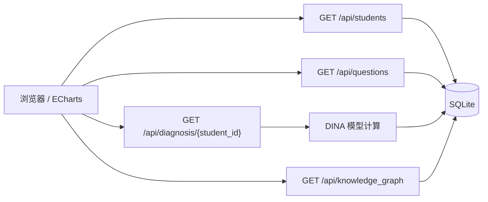

# API 契约文档

> **阶段**: SDD 建模  
> **协议**: RESTful over HTTP  
> **Content-Type**: `application/json; charset=utf-8`

---

## 1. Pydantic 数据模型

> 以下模型定义用于前后端类型校验。在实际代码中放置于 `app/contracts.py`，SDD 阶段仅定义契约，不实现逻辑。

### 1.1 Student

```python
from pydantic import BaseModel, Field


class Student(BaseModel):
    """学生模型"""
    id: int = Field(..., description="学生唯一标识")
    name: str = Field(..., description="学生姓名", example="学生01")

    class Config:
        from_attributes = True
```

### 1.2 KnowledgePoint

```python
class KnowledgePoint(BaseModel):
    """知识点模型（共 5 个）"""
    id: int = Field(..., description="知识点唯一标识")
    name: str = Field(..., description="知识点名称", example="加法")

    class Config:
        from_attributes = True
```

### 1.3 Question

```python
from typing import List


class Question(BaseModel):
    """题目模型（共 20 道）"""
    id: int = Field(..., description="题目唯一标识")
    content: str = Field(..., description="题目文本内容")
    covered_knowledge_points: List[int] = Field(
        default_factory=list,
        description="该题考查的知识点 ID 列表（来自 Q 矩阵）"
    )

    class Config:
        from_attributes = True
```

### 1.4 QMatrixEntry

```python
class QMatrixEntry(BaseModel):
    """Q 矩阵条目 — 单道题对单个知识点的覆盖关系"""
    question_id: int = Field(..., description="题目 ID")
    knowledge_point_id: int = Field(..., description="知识点 ID")
    is_covered: int = Field(..., ge=0, le=1, description="是否考查 (0/1)")

    class Config:
        from_attributes = True
```

### 1.5 XMatrixEntry

```python
class XMatrixEntry(BaseModel):
    """X 矩阵条目 — 单个学生对单道题的作答记录"""
    student_id: int = Field(..., description="学生 ID")
    question_id: int = Field(..., description="题目 ID")
    is_correct: int = Field(..., ge=0, le=1, description="作答正误 (0/1)")

    class Config:
        from_attributes = True
```

### 1.6 DiagnosisResult

```python
from typing import Dict


class RadarPoint(BaseModel):
    """雷达图单个维度数据点"""
    knowledge_point_id: int = Field(..., description="知识点 ID")
    knowledge_point_name: str = Field(..., description="知识点名称")
    mastery_probability: float = Field(
        ..., ge=0.0, le=1.0,
        description="掌握概率（DINA 后验估计，0~1 浮点数）"
    )


class DiagnosisResult(BaseModel):
    """学生诊断结果 — 用于雷达图渲染"""
    student_id: int = Field(..., description="学生 ID")
    student_name: str = Field(..., description="学生姓名")
    radar_data: List[RadarPoint] = Field(
        ..., min_length=5, max_length=5,
        description="5 个知识点的掌握概率数据"
    )
    answer_summary: Dict[str, int] = Field(
        ...,
        description="作答概况",
        example={"total": 20, "correct": 14, "incorrect": 6}
    )
```

### 1.7 KnowledgeGraphEdge

```python
class KnowledgeGraphEdge(BaseModel):
    """知识图谱有向边"""
    predecessor_kp_id: int = Field(..., description="前驱知识点 ID")
    predecessor_name: str = Field(..., description="前驱知识点名称")
    successor_kp_id: int = Field(..., description="后继知识点 ID")
    successor_name: str = Field(..., description="后继知识点名称")

    class Config:
        from_attributes = True


class KnowledgeGraphResponse(BaseModel):
    """知识图谱完整响应"""
    nodes: List[KnowledgePoint] = Field(..., description="知识点节点列表（5 个）")
    edges: List[KnowledgeGraphEdge] = Field(..., description="前驱后继有向边（≥4 条）")
```

### 1.8 HealthResponse

```python
class HealthResponse(BaseModel):
    """健康检查响应"""
    status: str = Field(default="ok")
    message: str = Field(default="环境初始化完成")
```

---

## 2. RESTful API 路由契约

### 2.1 GET /api/students

**描述**: 返回所有学生列表。

| 属性               | 值               |
| ---------------- | --------------- |
| **Method**       | `GET`           |
| **Endpoint**     | `/api/students` |
| **Query Params** | 无               |

**Response 200**:

```json
{
  "students": [
    {"id": 1, "name": "学生01"},
    {"id": 2, "name": "学生02"},
    {"id": 3, "name": "学生03"}
  ],
  "total": 3
}
```

**Pydantic 响应模型**:

```python
from typing import List


class StudentListResponse(BaseModel):
    students: List[Student]
    total: int = Field(..., description="学生总数（≥10）")
```

---

### 2.2 GET /api/questions

**描述**: 返回所有题目及每道题的 Q 矩阵信息（考查了哪些知识点）。

| 属性               | 值                |
| ---------------- | ---------------- |
| **Method**       | `GET`            |
| **Endpoint**     | `/api/questions` |
| **Query Params** | 无                |

**Response 200**:

```json
{
  "questions": [
    {
      "id": 1,
      "content": "3 + 5 = ?",
      "covered_knowledge_points": [1]
    },
    {
      "id": 5,
      "content": "(12 - 4) × 3 = ?",
      "covered_knowledge_points": [1, 3]
    }
  ],
  "total": 20
}
```

**Pydantic 响应模型**:

```python
class QuestionListResponse(BaseModel):
    questions: List[Question]
    total: int = Field(..., description="题目总数（=20）")
```

---

### 2.3 GET /api/diagnosis/{student_id}

**描述**: 返回指定学生在 5 个知识点上的掌握概率（DINA 后验估计），以及雷达图所需数据格式。

| 属性             | 值                             |
| -------------- | ----------------------------- |
| **Method**     | `GET`                         |
| **Endpoint**   | `/api/diagnosis/{student_id}` |
| **Path Param** | `student_id: int` — 学生 ID     |

**Response 200**:

```json
{
  "student_id": 1,
  "student_name": "学生01",
  "radar_data": [
    {
      "knowledge_point_id": 1,
      "knowledge_point_name": "加法",
      "mastery_probability": 0.92
    },
    {
      "knowledge_point_id": 2,
      "knowledge_point_name": "减法",
      "mastery_probability": 0.78
    },
    {
      "knowledge_point_id": 3,
      "knowledge_point_name": "乘法",
      "mastery_probability": 0.55
    },
    {
      "knowledge_point_id": 4,
      "knowledge_point_name": "除法",
      "mastery_probability": 0.41
    },
    {
      "knowledge_point_id": 5,
      "knowledge_point_name": "混合运算",
      "mastery_probability": 0.30
    }
  ],
  "answer_summary": {
    "total": 20,
    "correct": 14,
    "incorrect": 6
  }
}
```

**Response 404**:

```json
{
  "error": "student_not_found",
  "message": "学生 ID=99 不存在"
}
```

**Pydantic 响应模型**:

```python
# 正常响应: DiagnosisResult（见上文 1.6 节）

class ErrorResponse(BaseModel):
    error: str
    message: str
```

---

### 2.4 GET /api/knowledge_graph

**描述**: 返回知识图谱的完整结构，包括 5 个知识点节点及它们之间的前驱后继有向边（≥4 条）。

| 属性               | 值                      |
| ---------------- | ---------------------- |
| **Method**       | `GET`                  |
| **Endpoint**     | `/api/knowledge_graph` |
| **Query Params** | 无                      |

**Response 200**:

```json
{
  "nodes": [
    {"id": 1, "name": "加法"},
    {"id": 2, "name": "减法"},
    {"id": 3, "name": "乘法"},
    {"id": 4, "name": "除法"},
    {"id": 5, "name": "混合运算"}
  ],
  "edges": [
    {
      "predecessor_kp_id": 1,
      "predecessor_name": "加法",
      "successor_kp_id": 3,
      "successor_name": "乘法"
    },
    {
      "predecessor_kp_id": 2,
      "predecessor_name": "减法",
      "successor_kp_id": 3,
      "successor_name": "乘法"
    },
    {
      "predecessor_kp_id": 1,
      "predecessor_name": "加法",
      "successor_kp_id": 4,
      "successor_name": "除法"
    },
    {
      "predecessor_kp_id": 2,
      "predecessor_name": "减法",
      "successor_kp_id": 4,
      "successor_name": "除法"
    },
    {
      "predecessor_kp_id": 3,
      "predecessor_name": "乘法",
      "successor_kp_id": 5,
      "successor_name": "混合运算"
    },
    {
      "predecessor_kp_id": 4,
      "predecessor_name": "除法",
      "successor_kp_id": 5,
      "successor_name": "混合运算"
    }
  ]
}
```

**Pydantic 响应模型**:

```python
# KnowledgeGraphResponse（见上文 1.7 节）
```

---

## 3. API 路由总览



| # | Method | Endpoint                      | 用途           | 数据来源                                   |
| - | ------ | ----------------------------- | ------------ | -------------------------------------- |
| 1 | `GET`  | `/api/students`               | 学生列表         | `students` 表                           |
| 2 | `GET`  | `/api/questions`              | 题目列表 + Q 矩阵  | `questions` + `q_matrix`               |
| 3 | `GET`  | `/api/diagnosis/{student_id}` | 单生诊断 + 雷达图数据 | `x_matrix` + DINA 计算                   |
| 4 | `GET`  | `/api/knowledge_graph`        | 知识图谱结构       | `knowledge_points` + `knowledge_graph` |

---

## 4. 错误响应规范

所有错误响应遵循统一格式：

```json
{
  "error": "<error_code_snake_case>",
  "message": "<human_readable_message_in_chinese>"
}
```

| HTTP Status | error_code            | 触发条件             |
| ----------- | --------------------- | ---------------- |
| 400         | `bad_request`         | 请求参数格式错误         |
| 404         | `student_not_found`   | `student_id` 不存在 |
| 404         | `diagnosis_not_ready` | 该生尚无作答数据         |
| 500         | `internal_error`      | 服务器内部异常          |
