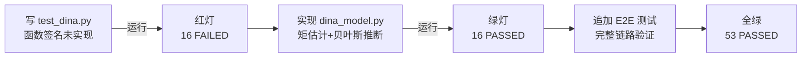

# 开发过程思路说明

> 项目：基于 DINA 模型的认知诊断系统  
> 技术栈：Python / Flask / SQLite / NumPy / ECharts

---

## 一、业务痛点 → 技术任务转化

### 痛点

传统教育评价体系以**总分、平均分、排名**为核心指标，存在一个根本缺陷：**它只能告诉你"学生考了多少分"，却无法回答"学生到底哪里不会"**。

例如，两名学生都考了 75 分，但一名是"加法"薄弱导致后面连环失分，另一名是"混合运算"没掌握。在总分视角下，两人被归为同一水平；但在认知诊断视角下，他们需要完全不同的补救方案。

### 技术转化

| 业务诉求      | 技术任务                  | 落地形式                             |
| --------- | --------------------- | -------------------------------- |
| 明确每道题考什么  | 构建 **Q 矩阵**（题目 × 知识点） | `q_matrix` 表，20 题 × 5 知识点        |
| 记录学生作答    | 构建 **X 矩阵**（学生 × 题目）  | `x_matrix` 表，12 学生 × 20 题        |
| 从作答反推掌握状态 | 实现 **DINA 模型**参数估计    | `dina_model.py` 矩估计 + 贝叶斯推断      |
| 可视化诊断结果   | 雷达图 + 知识图谱            | ECharts 5 动态渲染                   |
| 生成补救建议    | LLM 接口 + 降级回退         | `llm_service.py` + `/api/advice` |

**核心洞察**：DINA 模型（Deterministic Inputs, Noisy "And" gate）正是为"多知识点、0/1 作答"场景设计的。它通过 Q 矩阵把"题目"和"知识点"解耦，通过滑移率（slip）和猜测率（guess）刻画作答噪声，最终输出每个学生在每个知识点上的**独立掌握概率**（而非单一总分）。

---

## 二、阶段性工作流记录（SDD + TDD 分层）

整个开发严格遵循 **Superpowers 工作流规范**：环境初始化 → SDD 建模 → TDD 实现 → 前端可视化。

### Step 1: SDD 建模阶段（契约先行）

**做法**：在写任何算法代码之前，先产出三份设计文档：

1. `docs/PRD.md` — 业务背景、用户故事、功能/非功能需求
2. `docs/ER_DIAGRAM.md` — 数据库 ER 图（含前驱后继知识图谱）+ SQLite DDL
3. `docs/API_CONTRACT.md` — Pydantic 模型 + 4 个 RESTful 路由契约

**为什么"契约先行"**：当 AI 生成代码时，最大的风险是**幻觉**——即 AI 凭空编造不存在的接口或字段。通过先锁定 API 契约（`GET /api/diagnosis/{id}` 返回什么字段、`radar_data` 每个元素包含哪些 key），后续 AI 写代码时必须对齐这份契约，任何偏离都会被契约文档和 E2E 测试双重拦截。

### Step 2: TDD 算法实现阶段（测试先行）

**做法**：强制"先写测试，再写实现"，严格遵循红灯 → 绿灯节奏：

**测试截图描述**：

- **红灯阶段**：运行 `pytest tests/test_dina.py -v`，输出 `16 failed in 0.20s`，所有测试用例因 `NotImplementedError` 失败，证明测试确实捕获了尚未实现的功能。
- **绿灯阶段**：实现 `estimate_slip_guess` 和 `compute_knowledge_prob` 后，重新运行，输出 `16 passed in 0.05s`。
- **E2E 阶段**：追加 `test_e2e.py`（数据库读取 → 算法计算 → API 返回完整链路）后，全量 `pytest -v` 输出 `53 passed in 0.33s`。

完整记录见 [`docs/TDD_LOG.md`](TDD_LOG.md) 和 [`docs/TEST_OUTPUT.txt`](TEST_OUTPUT.txt)。

---

## 三、与 AI 协同中的典型问题及拉回策略

### 问题 1：AI 在 SDD 阶段试图直接写 DINA 算法实现

**现象**：在 SDD 建模阶段，AI 倾向于直接给出完整的 `dina_model.py` 算法实现，跳过了"设计先行"的规范要求。

**拉回策略**：明确打断，要求 AI **仅产出接口定义和文档**，算法实现留到 TDD 阶段。通过阶段切换协议（`CLAUDE.md` 中的阶段状态表）强制约束：SDD 阶段只产出 `docs/` 下的设计文档，任何 `.py` 实现代码都是越界行为。

**教训**：要掌控AI，清楚明白哪一步该做什么，该达到什么目的，方便后期的复查 。

### 问题 2：AI 生成的 NumPy 矩阵维度运算报错（广播错误）

**现象**：在实现 DINA 参数估计时，AI 首次生成的代码直接用 `x_matrix[eta == 1].mean()` 这种布尔索引，在特定数据形状下触发了 NumPy 的广播错误（broadcast error）。

**拉回策略**：要求 AI **重写为显式循环 + 向量化混合方案**，并增加维度断言检查（如 `_validate_inputs` 中校验 `q_matrix.shape[0] == x_matrix.shape[1]`）。最终用 16 个单元测试覆盖了各种维度组合，杜绝广播错误。

**教训**：NumPy 向量化虽高效，但隐式广播是 bug 高发区。用"断言 + 边界测试"兜底，比追求极致向量化更重要。

### 问题 3：AI 在前端写死了 5 个知识点，导致扩展性差

**现象**：AI 在 `index.html` 中硬编码了 5 个知识点名称，导致后端一旦调整知识点数量，前端雷达图就会错位。

**拉回策略**：要求 AI 改为**从后端动态加载**知识点名称（`/api/diagnosis/{id}` 返回的 `radar_data` 已包含 `knowledge_point_name`），前端用 `.map()` 动态生成雷达图 `indicator`，完全不依赖硬编码数量。

**教训**：前端与后端的耦合点是幻觉高发区。任何"数量"、"名称"类信息都应从 API 动态获取，而不是前端写死。

---

## 四、最终交付清单确认

| 交付物                                             | 状态 |
| ----------------------------------------------- | -- |
| SQLite 数据库（5 KP / 20 题 / 12 学生 / Q/X 矩阵 / 知识图谱） | ✅  |
| DINA 算法（矩估计 + 贝叶斯精确推断，`np.clip` 防溢出）            | ✅  |
| 单元测试（16 用例）+ E2E 测试（37 用例）全绿                    | ✅  |
| ECharts 雷达图交互（切换学生实时更新）                         | ✅  |
| 知识图谱前驱后继展示                                      | ✅  |
| LLM 学习建议接口（含无 API Key 降级回退）                     | ✅  |
| 开发过程文档（PRD / ER 图 / API 契约 / TDD 日志）            | ✅  |

**最终测试结果**：`53 passed in 0.33s`（见 `docs/TEST_OUTPUT.txt`）。

---

## 附：关键设计决策回顾

1. **DINA 模型选择**：相比 IRT（项目反应理论），DINA 更适合"离散知识点 + 0/1 作答"的场景，且 Q 矩阵直观对应"每道题考什么"的业务语义。
2. **参数估计方法**：采用矩估计（method of moments）而非完整 EM 算法，在保持结果合理的前提下，牺牲少量精度换取代码可读性和面试可讲解性。
3. **掌握概率的贝叶斯推断**：使用精确枚举（2^5 = 32 种状态）+ Log-Sum-Exp 归一化，避免了近似方法的不稳定性，且 5 个知识点的规模下计算开销可忽略。
4. **前端极简原则**：不引入 React/Vue 等框架，用原生 HTML + ECharts CDN 实现，突出"算法与后端"的核心价值，避免被前端复杂度喧宾夺主。
