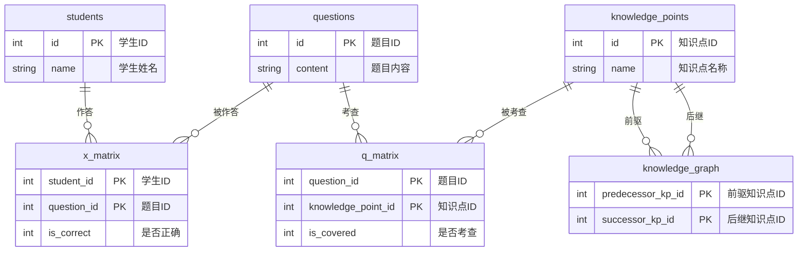
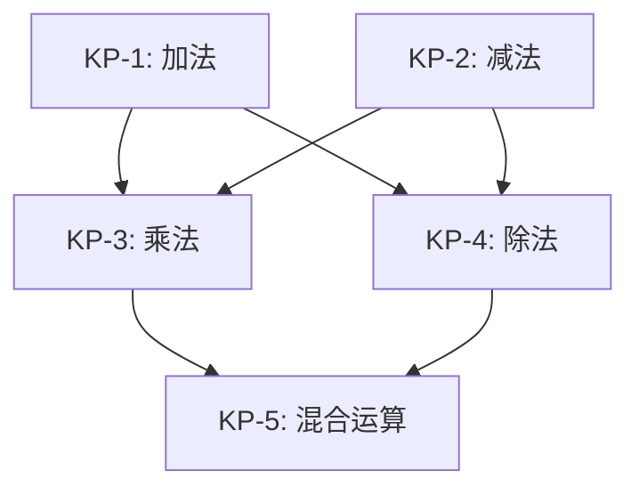

# ER 图 & 数据库 Schema 定义

> **阶段**: SDD 建模
> **数据库**: SQLite 3.x
> **编码**: UTF-8

---

## 1. 实体关系图（Mermaid ER）



---

## 2. 实体说明

### 2.1 students（学生表）

| 字段 | 类型 | 约束 | 说明 |
|---|---|---|---|
| `id` | INTEGER | PRIMARY KEY AUTOINCREMENT | 学生唯一标识 |
| `name` | TEXT | NOT NULL | 学生姓名 |

**数据规模**: ≥ 10 条记录

### 2.2 questions（题目表）

| 字段 | 类型 | 约束 | 说明 |
|---|---|---|---|
| `id` | INTEGER | PRIMARY KEY AUTOINCREMENT | 题目唯一标识 |
| `content` | TEXT | NOT NULL | 题目文本内容 |

**数据规模**: 20 条记录

### 2.3 knowledge_points（知识点表）

| 字段 | 类型 | 约束 | 说明 |
|---|---|---|---|
| `id` | INTEGER | PRIMARY KEY AUTOINCREMENT | 知识点唯一标识 |
| `name` | TEXT | NOT NULL UNIQUE | 知识点名称（如：加法、减法、乘法、除法、混合运算） |

**数据规模**: 5 条记录

### 2.4 q_matrix（Q 矩阵关联表）

定义每道题考查了哪些知识点，是 DINA 模型的核心输入之一。

| 字段 | 类型 | 约束 | 说明 |
|---|---|---|---|
| `question_id` | INTEGER | PRIMARY KEY (复合) | 题目外键 |
| `knowledge_point_id` | INTEGER | PRIMARY KEY (复合) | 知识点外键 |
| `is_covered` | INTEGER | NOT NULL, CHECK(0 OR 1) | 该题是否考查该知识点 |

- **主键**: `(question_id, knowledge_point_id)` 复合主键
- **外键**: `question_id → questions(id)`, `knowledge_point_id → knowledge_points(id)`

**数据规模**: 20 题 × 5 知识点 = 100 条记录（每道题至少考查 1 个知识点）

### 2.5 x_matrix（X 矩阵作答表）

记录每个学生对每道题的作答正误，是 DINA 模型的另一核心输入。

| 字段 | 类型 | 约束 | 说明 |
|---|---|---|---|
| `student_id` | INTEGER | PRIMARY KEY (复合) | 学生外键 |
| `question_id` | INTEGER | PRIMARY KEY (复合) | 题目外键 |
| `is_correct` | INTEGER | NOT NULL, CHECK(0 OR 1) | 作答正误（1=正确，0=错误） |

- **主键**: `(student_id, question_id)` 复合主键
- **外键**: `student_id → students(id)`, `question_id → questions(id)`

**数据规模**: ≥10 名学生 × 20 题 = ≥200 条记录

### 2.6 knowledge_graph（知识图谱前驱后继表）

定义知识点之间的层级依赖关系。若 `A → B` 表示 A 是 B 的前驱知识点（必须先掌握 A 才能学好 B）。

| 字段 | 类型 | 约束 | 说明 |
|---|---|---|---|
| `predecessor_kp_id` | INTEGER | PRIMARY KEY (复合) | 前驱知识点外键 |
| `successor_kp_id` | INTEGER | PRIMARY KEY (复合) | 后继知识点外键 |

- **主键**: `(predecessor_kp_id, successor_kp_id)` 复合主键
- **外键**: 两列均引用 `knowledge_points(id)`
- **约束**: 不允许自环 `predecessor_kp_id ≠ successor_kp_id`

**数据规模**: ≥4 条有向边（覆盖 5 个知识点的层级关系）

---

## 3. 知识点层级关系设计（示例）



此结构表达：**加法/减法** → **乘法/除法** → **混合运算** 的学习路径。

对应的 `knowledge_graph` 数据：

| predecessor_kp_id | successor_kp_id | 含义 |
|---|---|---|
| 1 (加法) | 3 (乘法) | 加法是乘法的基础 |
| 2 (减法) | 3 (乘法) | 减法是乘法的基础 |
| 1 (加法) | 4 (除法) | 加法是除法的基础 |
| 2 (减法) | 4 (除法) | 减法是除法的基础 |
| 3 (乘法) | 5 (混合运算) | 乘法是混合运算的基础 |
| 4 (除法) | 5 (混合运算) | 除法是混合运算的基础 |

---

## 4. SQLite DDL

```sql
-- ============================================
-- 认知诊断系统 — 数据库 Schema
-- 阶段: SDD 建模
-- 数据库: SQLite 3.x
-- ============================================

PRAGMA foreign_keys = ON;

-- --------------------------------------------
-- 4.1 学生表
-- --------------------------------------------
CREATE TABLE IF NOT EXISTS students (
    id INTEGER PRIMARY KEY AUTOINCREMENT,
    name TEXT NOT NULL
);

-- --------------------------------------------
-- 4.2 题目表
-- --------------------------------------------
CREATE TABLE IF NOT EXISTS questions (
    id INTEGER PRIMARY KEY AUTOINCREMENT,
    content TEXT NOT NULL
);

-- --------------------------------------------
-- 4.3 知识点表（共 5 个知识点）
-- --------------------------------------------
CREATE TABLE IF NOT EXISTS knowledge_points (
    id INTEGER PRIMARY KEY AUTOINCREMENT,
    name TEXT NOT NULL UNIQUE
);

-- --------------------------------------------
-- 4.4 Q 矩阵关联表（题目 × 知识点）
-- 数据规模: 20 题 × 5 知识点 = 100 条
-- --------------------------------------------
CREATE TABLE IF NOT EXISTS q_matrix (
    question_id INTEGER NOT NULL,
    knowledge_point_id INTEGER NOT NULL,
    is_covered INTEGER NOT NULL CHECK (is_covered IN (0, 1)),
    PRIMARY KEY (question_id, knowledge_point_id),
    FOREIGN KEY (question_id) REFERENCES questions(id),
    FOREIGN KEY (knowledge_point_id) REFERENCES knowledge_points(id)
);

-- --------------------------------------------
-- 4.5 X 矩阵作答表（学生 × 题目）
-- 数据规模: ≥10 名学生 × 20 题 = ≥200 条
-- --------------------------------------------
CREATE TABLE IF NOT EXISTS x_matrix (
    student_id INTEGER NOT NULL,
    question_id INTEGER NOT NULL,
    is_correct INTEGER NOT NULL CHECK (is_correct IN (0, 1)),
    PRIMARY KEY (student_id, question_id),
    FOREIGN KEY (student_id) REFERENCES students(id),
    FOREIGN KEY (question_id) REFERENCES questions(id)
);

-- --------------------------------------------
-- 4.6 知识图谱前驱后继表
-- 数据规模: ≥4 条有向边
-- --------------------------------------------
CREATE TABLE IF NOT EXISTS knowledge_graph (
    predecessor_kp_id INTEGER NOT NULL,
    successor_kp_id INTEGER NOT NULL,
    PRIMARY KEY (predecessor_kp_id, successor_kp_id),
    FOREIGN KEY (predecessor_kp_id) REFERENCES knowledge_points(id),
    FOREIGN KEY (successor_kp_id) REFERENCES knowledge_points(id),
    CHECK (predecessor_kp_id != successor_kp_id)
);

-- --------------------------------------------
-- 4.7 索引（优化查询性能）
-- --------------------------------------------
CREATE INDEX IF NOT EXISTS idx_x_matrix_student ON x_matrix(student_id);
CREATE INDEX IF NOT EXISTS idx_x_matrix_question ON x_matrix(question_id);
CREATE INDEX IF NOT EXISTS idx_q_matrix_question ON q_matrix(question_id);
CREATE INDEX IF NOT EXISTS idx_q_matrix_kp ON q_matrix(knowledge_point_id);
CREATE INDEX IF NOT EXISTS idx_kg_predecessor ON knowledge_graph(predecessor_kp_id);
CREATE INDEX IF NOT EXISTS idx_kg_successor ON knowledge_graph(successor_kp_id);
```

---

## 5. 数据规模汇总

| 表名 | 预置记录数 | 说明 |
|---|---|---|
| `students` | **≥10 条** | 模拟学生 |
| `questions` | **20 条** | 模拟题目 |
| `knowledge_points` | **5 条** | 加法、减法、乘法、除法、混合运算 |
| `q_matrix` | **20 × 5 = 100 条** | 每题目×每知识点的覆盖标记 |
| `x_matrix` | **≥10 × 20 = ≥200 条** | 每学生×每题的作答记录 |
| `knowledge_graph` | **≥4 条** | 知识点的前驱后继层级关系 |
| **总计** | **≥339 条** | — |
