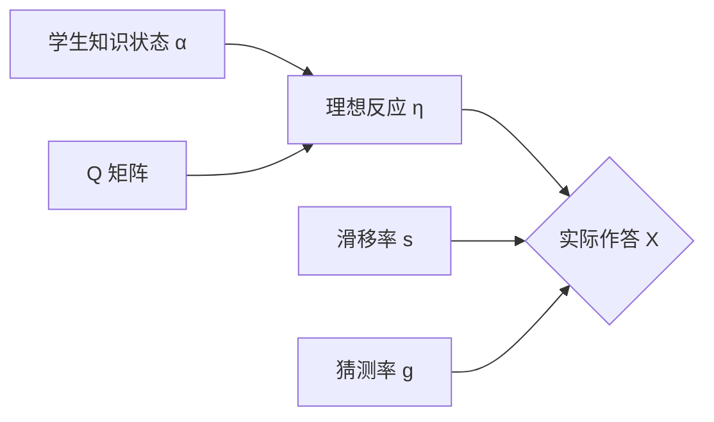
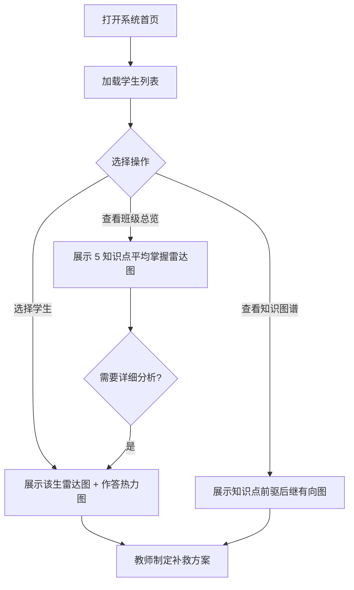
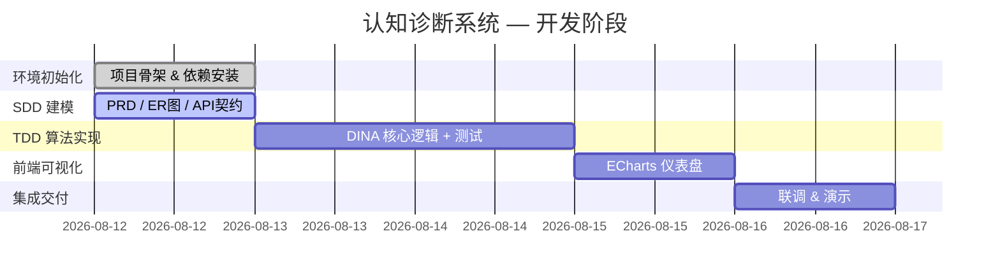

# PRD — 认知诊断系统产品需求文档

> **阶段**: SDD 建模
> **版本**: v1.0
> **日期**: 2026-08-12

---

## 1. 业务背景

### 1.1 问题域

传统教育评价以"总分/排名"为核心，无法回答根本性问题：**学生到底哪里不会？**

认知诊断（Cognitive Diagnosis）是 AI + 教育的交叉领域，其目标是通过学生对题目的作答数据（0/1 正确/错误），反向推断学生在各**知识点**上的掌握状态，从而实现：

- **个性化补救**：知道每个学生的薄弱知识点
- **精准教学**：教师可根据班级整体掌握热力图调整教学计划
- **形成性评价**：不只看结果，更看过程和结构

### 1.2 DINA 模型简介

本系统采用 DINA 模型（Deterministic Inputs, Noisy "And" gate），该模型将答题过程建模为：

- **Q 矩阵**：定义每道题考查了哪些知识点（5 个知识点 × 20 道题）
- **α 向量**：学生的知识掌握状态（0/1 二值向量，共 5 维）
- **η（eta）**：理想反应 — 若学生掌握了题目所需全部知识点，η=1，否则 η=0
- **s（slip）**：滑移率 — 本应做对却做错的概率
- **g（guess）**：猜测率 — 本应做错却猜对的概率

### 1.3 核心价值

| 角色 | 收益 |
|---|---|
| **教师** | 查看班级知识掌握雷达图，定位薄弱知识点，精准布置补救练习 |
| **学生** | 了解自己的知识结构，明确哪些知识点已掌握、哪些需加强 |
| **教研员** | 基于知识图谱的前驱后继关系，分析学习的层级障碍 |

---

## 2. 用户故事

### US-1：教师查看班级诊断概览

> **作为** 一名数学教师，
> **我希望** 在地图/雷达图上看到全班学生在 5 个知识点上的掌握分布，
> **以便** 我能够决定下一节课重点讲解哪个知识点。

**验收标准**:
- 页面展示 5 个知识点的班级平均掌握率（0~1 浮点数）
- 使用 ECharts 雷达图渲染
- 支持切换查看单个学生的诊断结果

### US-2：教师查看学生个体诊断

> **作为** 一名数学教师，
> **我希望** 选择一个学生后看到他对 5 个知识点的掌握概率和作答记录，
> **以便** 我能够为他制定个性化的补救方案。

**验收标准**:
- 从学生列表中选择学生后，雷达图实时更新
- 显示该学生在 20 道题上的作答情况（对/错）
- 标注每道题关联的知识点

### US-3：教师查看知识图谱

> **作为** 一名数学教师，
> **我希望** 看到 5 个知识点之间的前驱后继依赖关系，
> **以便** 我能够理解学生的学习路径障碍（即前驱知识点未掌握 → 后继知识点学习困难）。

**验收标准**:
- 以 Mermaid 图/ECharts 关系图展示 5 个知识点的有向依赖关系
- 鼠标悬停时显示知识点名称

---

## 3. 功能性需求

### 3.1 数据管理模块

| ID | 需求 | 数据规模 |
|---|---|---|
| FR-01 | 系统预置 **5 个知识点**（如：加法、减法、乘法、除法、混合运算） | 5 条记录 |
| FR-02 | 系统预置 **20 道题目**，每道题关联 1~3 个知识点 | 20 条记录 |
| FR-03 | 系统预置 Q 矩阵（题目 × 知识点，0/1 二值） | 20 × 5 = 100 个元素 |
| FR-04 | 系统生成至少 **10 名学生**的模拟作答数据 | ≥10 条学生记录 |
| FR-05 | X 矩阵（学生 × 题目作答，0/1 二值）自动生成 | ≥10 × 20 = 200 个元素 |
| FR-06 | 知识图谱前驱后继关系预置 | ≥4 条有向边 |

### 3.2 诊断计算模块

| ID | 需求 | 说明 |
|---|---|---|
| FR-07 | 基于 DINA 模型对学生作答数据进行参数估计 | 估计滑移率 s 和猜测率 g |
| FR-08 | 计算每个学生在 5 个知识点上的后验掌握概率 | 输出 0~1 浮点数 |
| FR-09 | 支持最大似然估计（MLE）或最大后验估计（MAP） | 输出 α 向量 |

### 3.3 可视化展示模块

| ID | 需求 | 说明 |
|---|---|---|
| FR-10 | 学生列表页（表格展示 10+ 名学生的基本信息） | HTML 表格 |
| FR-11 | 知识点掌握雷达图（5 个维度） | ECharts radar chart |
| FR-12 | 知识图谱有向关系图 | ECharts graph / force layout |
| FR-13 | 作答矩阵热力图（学生 × 题目） | ECharts heatmap |

### 3.4 API 接口模块

| ID | 需求 | 路由 |
|---|---|---|
| FR-14 | 获取学生列表 | `GET /api/students` |
| FR-15 | 获取题目列表（含 Q 矩阵信息） | `GET /api/questions` |
| FR-16 | 获取学生诊断结果（含雷达图数据） | `GET /api/diagnosis/{student_id}` |
| FR-17 | 获取知识图谱结构 | `GET /api/knowledge_graph` |

---

## 4. 非功能性需求

### 4.1 性能与资源

| ID | 需求 | 指标 |
|---|---|---|
| NFR-01 | 轻量级部署 — 无需 MySQL/PostgreSQL 等外部数据库服务 | 使用 SQLite 文件数据库 |
| NFR-02 | 诊断计算在 100 名学生 × 20 题规模下 | < 1 秒 |
| NFR-03 | API 响应时间（P95） | < 500ms |
| NFR-04 | 前端首次加载时间（含 ECharts CDN） | < 3 秒 |

### 4.2 可维护性

| ID | 需求 |
|---|---|
| NFR-05 | 代码遵循 Superpowers 工作流阶段划分，模块 docstring 标注所属阶段 |
| NFR-06 | 数据库 DDL 与 ER 图同步维护在 `docs/` 目录 |
| NFR-07 | API 契约使用 Pydantic 模型定义，确保前后端类型一致 |

### 4.3 兼容性

| ID | 需求 |
|---|---|
| NFR-08 | Python 版本 ≥ 3.9 |
| NFR-09 | 浏览器兼容：Chrome 90+、Edge 90+、Firefox 88+ |
| NFR-10 | Windows / macOS / Linux 均可运行（无平台特定依赖） |

---

## 5. 数据规模汇总

| 实体 | 数量 |
|---|---|
| 知识点（knowledge_points） | **5 个** |
| 题目（questions） | **20 道** |
| 学生（students） | **≥10 名** |
| Q 矩阵（q_matrix） | **20 × 5 = 100 个二值元素** |
| X 矩阵（x_matrix） | **≥10 × 20 = 200 个二值元素** |
| 知识图谱边（knowledge_graph） | **≥4 条有向边** |

---

## 6. 用户流程

---

## 7. 里程碑与阶段划分

